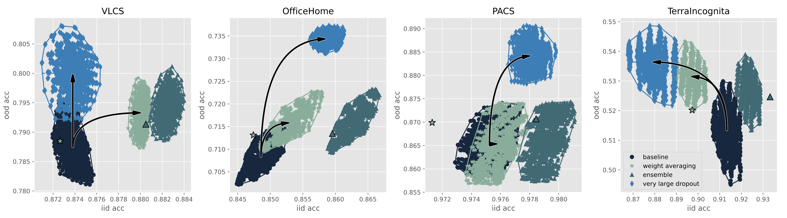

# Fine-tuning with very large Dropout

Official PyTorch implementation of [Fine-tuning with very large Dropout](https://arxiv.org/abs/2403.00946)
# TL;DR
out-of-distribution fine-tuning with very large dropout (90%) exceeds ensemble and weight-averaging methods

# Abstract 

It is impossible today to pretend that the practice of machine learning is compatible with the idea that training and testing data follow the same distribution. Several authors have recently used ensemble techniques to show how scenarios involving multiple data distributions are best served by representations that are both richer than those obtained by regularizing for the best in-distribution performance, and richer than those obtained under the influence of the implicit sparsity bias of common stochastic gradient procedures.

This contribution investigates the use of very high dropout rates instead of ensembles to obtain such rich representations. Although training a deep network from scratch using such dropout rates is virtually impossible, fine-tuning a large pre-trained model under such conditions is not only possible but also achieves out-of-distribution performances that exceed those of both ensembles and weight averaging methods such as model soups.

This result has practical significance because the importance of the fine-tuning scenario has considerably grown in recent years. This result also provides interesting insights on the nature of rich representations and on the intrinsically linear nature of fine-tuning a large network using a comparatively small dataset.


# Datasets (Domainbed suite)


We evaluate on following [datasets](domainbed/datasets.py) from [Domainbed](https://github.com/facebookresearch/DomainBed/tree/main) suite. (Hereby this code is adapted from the open-source [Domainbed](https://github.com/facebookresearch/DomainBed/tree/main) and [DiWA](https://github.com/alexrame/diwa/tree/main).):

* VLCS ([Fang et al., 2013](https://openaccess.thecvf.com/content_iccv_2013/papers/Fang_Unbiased_Metric_Learning_2013_ICCV_paper.pdf))
* PACS ([Li et al., 2017](https://arxiv.org/abs/1710.03077))
* OfficeHome ([Venkateswara et al., 2017](https://arxiv.org/abs/1706.07522))
* TerraIncognita ([Beery et al., 2018](https://arxiv.org/abs/1807.04975)) subset
* DomainNet ([Peng et al., 2019](http://ai.bu.edu/M3SDA/))


# Quick start 


### You can download datasets with following commands: 

```sh
python3 -m domainbed.scripts.download --data_dir=/my/data/dir
```

### You can fine-tune with very large dropout with following commands: 

```sh
python -m domainbed.scripts.trainv2   --data_dir=/my/data/dir \
--output_dir ${output_dir}   \
--seed ${seed} \
--steps 10001 \
--dataset ${dataset}  --algorithm ERM  \
--test_env ${test_env}  \
--hparams="{\"pretrain_version\":\"v2\",\"resnet_dropout\":0.9,
\"weight_decay\":${weight_decay},\"lr\":${lr},\"lastlrfac\":1}" 
```

* Choose ${dataset} from ```VLCS```, ```PACS```, ```OfficeHome```, and ```TerraIncognita```.
* Choose ${test_env} from ```0``` to ```3``` to set corresponding environment as the test envorinment. 
* Choose ${lr} from ```[5e-4, 1e-3]``` and ${weight_decay} from ```[1e-4, 5e-5, 1e-5]```.
* Note: For each ```${dataset} ${test_env} ${lr} ${weight_decay}``` combination, we repeat three trials with different seeds to reduce evaluation variance. Then (for each trials) we pick the training iterations corresponding to the best IID validation accuracy. Finally, we report the averaged IID and OOD validation accuracies. 


  

# Results

### Performance comparison between very large dropout, ensembles, and weight averaging methods



*<p style="text-align: center;"> Figure 1: The horizontal axis denotes the i.i.d. performance and the vertical axis the o.o.d. performance. Baseline results were obtained using plain fine-tuning with different hyperparameters (1296×●). Weight averaging results either average the model weights collected every 300 iterations along each fine-tuning trajectory (1296× green star) or the final model weights of all fine-tuning trajectories (1× green star with black edge) as in [(Rame et al. ,2022b)](https://arxiv.org/abs/2205.09739). Ensemble results average instead the model outputs (1296× teal triangle and 1× teal triangle with black edge). Finally, large dropout results were obtained like the baseline results but using a 90% dropout rate on the penultimate layer.</p>*

### Effect of diverse dropout rates during fine-tuning

*<p style="text-align: center;">Figure 2: The best o.o.d. performances are attained using rates around or above 90%.</p>*

# Citation
If you find this code useful for your research, please consider citing our work:

```sh
@article{zhang2024fine,
  title={Fine-tuning with Very Large Dropout},
  author={Zhang, Jianyu and Bottou, L{\'e}on},
  journal={arXiv preprint arXiv:2403.00946},
  year={2024}
}
```
